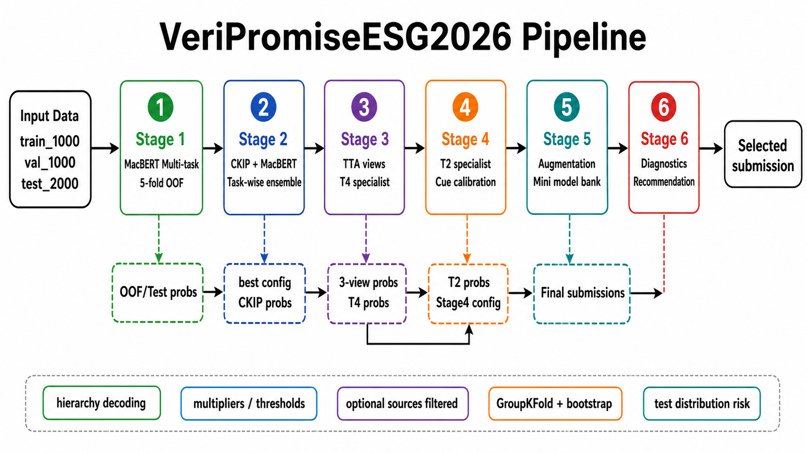

# VeriPromiseESG2026 Colab Pipeline

這個 repository 是 AI CUP 2026 ESG 永續承諾驗證競賽的 Colab-first 重現流程。專案以一組依序執行的 Jupyter notebooks，重現從資料讀取、模型訓練、後處理、模型融合、final submission 產生，到 submission 診斷與推薦的完整 pipeline。

本 repo 的重點是「可重現的公開流程」，不是模型權重發佈。公開內容包含 Stage notebooks、說明文件、訓練資料 `vpesg4k_train_1000.json` 與 `sample_submission_format.csv`；validation/test data、Google Drive 輸出、checkpoint、probability cache 與 submission 檔案不放在公開 GitHub。

## Pipeline Overview



## 專案內容

```text
.
├── assets/
│   └── pipeline-flow.png
├── notebooks/
│   ├── Stage1_macbert_multitask_baseline.ipynb
│   ├── Stage2_ckip_taskwise_ensemble.ipynb
│   ├── Stage3_tta_t4_specialist_blend.ipynb
│   ├── Stage4_t2_specialist_calibration.ipynb
│   ├── Stage5_model_bank_final_submission.ipynb
│   └── Stage6_submission_diagnostic_optional.ipynb
├── data/
│   └── README.md
├── outputs/
│   └── README.md
├── tools/
│   └── prepare_public_notebooks.py
├── requirements_colab.txt
├── RESULTS.md
└── README.md
```

## 任務概要

模型針對企業 ESG 永續報告段落進行四個欄位的階層式分類：

| 欄位 | 說明 | 階層規則 |
| --- | --- | --- |
| `promise_status` | 判斷段落是否包含企業承諾 | 若為 `No`，其餘欄位皆為 `N/A` |
| `verification_timeline` | 判斷承諾驗證或實現的時間軸 | 只有 `promise_status = Yes` 時有效 |
| `evidence_status` | 判斷段落是否提供支持承諾的證據 | 只有 `promise_status = Yes` 時有效 |
| `evidence_quality` | 判斷證據是否清楚、充分或可能誤導 | 只有 `evidence_status = Yes` 時有效 |

所有 notebooks 在 prediction decoding 階段都會套用階層規則：

```text
promise_status = No
-> verification_timeline = N/A
-> evidence_status = N/A
-> evidence_quality = N/A

evidence_status != Yes
-> evidence_quality = N/A
```

Local validation score 使用競賽任務對應的 weighted score：

```text
weighted_score =
  promise_status F1        * 0.20
  verification_timeline F1 * 0.15
  evidence_status F1       * 0.30
  evidence_quality F1      * 0.35
```

`promise_status` 與 `evidence_status` 使用 Yes 類別 F1；`verification_timeline` 與 `evidence_quality` 使用 macro-F1。

## 執行環境

建議使用 Google Colab 執行。完整訓練流程需要 GPU，A100 最穩定；非 A100 runtime 可以執行，但訓練時間會明顯增加。

| 項目 | 設定 |
| --- | --- |
| Runtime | Google Colab |
| GPU | A100 recommended |
| Storage | Google Drive |
| Python packages | 每本 notebook 會在第一個 cell 安裝必要套件 |
| Local machine | 不需要本機 GPU |

套件版本範圍列於 `requirements_colab.txt`。主要依賴包含 `torch`、`transformers`、`pandas`、`numpy`、`scikit-learn`、`tqdm`、`accelerate` 與 `openpyxl`。

## 資料準備

請在 Google Drive 建立以下資料夾：

```text
/content/drive/MyDrive/VeriPromiseESG2026/
  data/
  outputs/
```

公開 repo 已包含：

```text
data/
  vpesg4k_train_1000.json
  sample_submission_format.csv
```

請將它們複製到 Google Drive，並另外依競賽規則準備 validation/test data：

```text
/content/drive/MyDrive/VeriPromiseESG2026/data/
  vpesg4k_train_1000.json
  vpesg4k_valdata_1000.json
  vpesg4k_testdata_2000.json
  sample_submission_format.csv
```

所有 notebooks 預設使用：

```python
BASE_DIR = "/content/drive/MyDrive/VeriPromiseESG2026"
```

如果你的 Drive 路徑不同，請修改每本 notebook 第一個設定區塊的 `BASE_DIR`。

## 使用方式

在 Colab 中依序執行：

1. `notebooks/Stage1_macbert_multitask_baseline.ipynb`
2. `notebooks/Stage2_ckip_taskwise_ensemble.ipynb`
3. `notebooks/Stage3_tta_t4_specialist_blend.ipynb`
4. `notebooks/Stage4_t2_specialist_calibration.ipynb`
5. `notebooks/Stage5_model_bank_final_submission.ipynb`
6. `notebooks/Stage6_submission_diagnostic_optional.ipynb`

每本 notebook 的第一個 setup cell 會：

- 安裝必要 Python packages
- 掛載 Google Drive
- 檢查 GPU
- 建立該 Stage 的輸出資料夾
- 檢查必要輸入檔是否存在
- 用一致格式印出 `BASE_DIR`、`DATA_DIR`、`OUTPUT_DIR`

若必要輸入不存在，notebook 會在前段直接報錯並列出缺少的 Drive 路徑。

## Stage Pipeline

| Stage | Notebook | 功能 | 主要輸出 |
| --- | --- | --- | --- |
| Stage 1 | `Stage1_macbert_multitask_baseline.ipynb` | MacBERT multi-task 5-fold baseline | `stage1_oof_val_test_probs.pkl`, `stage1_baseline_test2000_submission.csv` |
| Stage 2 | `Stage2_ckip_taskwise_ensemble.ipynb` | Stage1 後處理、CKIP/MacBERT task-wise ensemble | `stage2_ckip_oof_val_test_probs.pkl`, `stage2_best_val_test2000_submission.csv` |
| Stage 3 | `Stage3_tta_t4_specialist_blend.ipynb` | Head/middle/tail TTA 與 T4 evidence quality specialist | `stage3_3view_probs.pkl`, `stage3_best_val_test2000_submission.csv` |
| Stage 4 | `Stage4_t2_specialist_calibration.ipynb` | T2 verification timeline specialist 與 cue calibration | `stage4_config.json`, `stage4_best_val_test2000_submission.csv`, `stage4_safe_test2000_submission.csv` |
| Stage 5 | `Stage5_model_bank_final_submission.ipynb` | Minority augmentation 與 final model bank ensemble | `stage5_best_val_test2000_submission.csv`, `stage5_low_risk_high_score_test2000_submission.csv`, `stage5_safe_test2000_submission.csv` |
| Stage 6 | `Stage6_submission_diagnostic_optional.ipynb` | Submission score、group stability、test distribution risk 診斷 | `stage6_recommendation.csv`, `stage6_submission_diagnostic.xlsx`, `stage6_report.md` |

Stage 6 是選跑診斷，不是產生 submission 的必要步驟。若只需要 submission 檔，跑完 Stage 5 即可；若要比較穩定性與分布風險，建議繼續跑 Stage 6。

## 技術設計概要

整體方法不是單一模型直接輸出 final submission，而是以「多任務 baseline → 任務別校正 → specialist 補強 → model bank 融合 → 風險診斷」逐步堆疊。每個 Stage 都會保留固定檔名的中間 artifacts，讓後續 Stage 可以重建前一階段的 validation predictions 與 test submissions。

| 模組 | 技術重點 | 目的 |
| --- | --- | --- |
| Multi-task baseline | `hfl/chinese-macbert-base`，四任務 shared encoder + task heads，5-fold OOF | 建立可重現的基準機率與第一版 submission |
| Task-wise ensemble | 加入 `ckiplab/bert-base-chinese`，依任務融合 MacBERT/CKIP 機率 | 補強不同 backbone 對任務的偏差 |
| Post-processing | 類別 multipliers、`promise_status` / `evidence_status` threshold search、階層規則 decoding | 修正 validation 分布與 cascade error |
| TTA views | head / middle / tail / mixed text views | 降低單一截斷策略造成的資訊損失 |
| Specialists | T4 evidence quality specialist、T2 verification timeline specialist | 針對較難且影響分數的任務補強 |
| Minority augmentation | 針對 `within_2_years`、`more_than_5_years`、`Not Clear`、`Misleading` 建立少數類 synthetic seeds，並用 cue gate 過濾 | 改善稀有類別學習訊號 |
| Mini model bank | 收集 Stage 3/4/5 的 T2 probability sources，搜尋低風險融合權重 | 在 validation score 與 test distribution risk 之間取折衷 |
| Submission diagnostic | GroupKFold、company/pdf/source bootstrap、test distribution risk、heuristic recommendation | 避免只看單一 validation score 選 submission |

幾個實作細節：

- 每次模型訓練都以 OOF artifacts 連接下一個 Stage，避免只依賴單次 holdout prediction。
- `evidence_quality` 和 `verification_timeline` 是主要提升目標，因此後段 specialist 與 cue calibration 多集中在 T4/T2。
- Stage 4/5 會動態過濾 optional sources，例如 `stage4_distribution_matched`；若某個候選沒有產生，流程會跳過而不是中斷。
- Stage 5 已包含舊版 `view_preset` 名稱相容處理，例如 `head_mid`，方便讀取先前 Stage 產出的 config。
- Stage 6 不只排序 validation score，也同時看 company group stability、bootstrap win rate、test label distribution drift，因此推薦結果可能偏向較保守版本。

## 輸出位置

每個 Stage 會寫入固定 Google Drive 輸出資料夾：

```text
/content/drive/MyDrive/VeriPromiseESG2026/outputs/
  stage1_macbert_multitask_baseline/
  stage2_ckip_taskwise_ensemble/
  stage3_tta_t4_specialist_blend/
  stage4_t2_specialist_calibration/
  stage5_model_bank_final_submission/
  stage6_submission_diagnostic_optional/
```

Stage 5 通常會產生三個主要 submission 候選：

| 檔案 | 用途 |
| --- | --- |
| `stage5_best_val_test2000_submission.csv` | validation score 較高 |
| `stage5_low_risk_high_score_test2000_submission.csv` | 分數與 test distribution risk 折衷 |
| `stage5_safe_test2000_submission.csv` | 較保守，重視分布穩定性 |

正式提交前建議查看 Stage 6 的 `stage6_recommendation.csv` 與 `stage6_report.md`。

## 已知結果

完整流程已在 Google Colab A100 上跑通。最近一次 Stage 6 摘要：

| 版本 | Local weighted score | 備註 |
| --- | ---: | --- |
| `stage5_best_val` | 0.699151 | validation score 最高 |
| `stage5_aug_best_val` | 0.698536 | group stability 表現較穩 |
| `stage5_low_risk_high_score` | 0.698536 | 分數與風險折衷 |
| `stage5_aug_distribution_matched` | 0.696152 | Stage 6 recommendation heuristic 排名前段 |
| `stage5_aug_safe` | 0.696956 | 較保守版本 |

詳細分數與診斷摘要請見 `RESULTS.md`。由於 Colab runtime、套件版本與模型訓練隨機性可能造成些微差異，正式結果請以當次完整重跑產出的 Stage 6 報告為準。

## Troubleshooting

常見問題：

- `FileNotFoundError`: 請確認 Google Drive 中的 `BASE_DIR` 與 `data/`、`outputs/` 路徑一致。
- GPU 不足或訓練太慢: 建議切換 Colab A100 runtime，並逐 Stage 執行。
- Stage 4/5 optional source 不存在: notebooks 會動態過濾不可用候選，例如 `stage4_distribution_matched`。
- Stage 5 view preset mismatch: notebook 已包含舊版 config 的 view preset 相容處理，例如 `head_mid`。

## 公開 GitHub 注意事項

可以提交：

- `data/vpesg4k_train_1000.json`
- `data/sample_submission_format.csv`

請不要提交：

- `data/vpesg4k_valdata_1000.json`
- `data/vpesg4k_testdata_2000.json`
- `outputs/*`
- `*.pt`
- `*.bin`
- `*.pkl`
- Google Drive 產生的 submission、diagnostic、checkpoint、probability cache
- 私人討論紀錄或歷史實驗草稿

本 repo 已提供 `.gitignore`。公開前建議檢查：

```bash
git status --short
git check-ignore -v data/vpesg4k_valdata_1000.json
git check-ignore -v outputs/stage5_model_bank_final_submission/stage5_best_val_test2000_submission.csv
```

若用 ZIP 或 GitHub 網頁拖放上傳，請手動確認 `data/` 只有 `README.md`、`vpesg4k_train_1000.json`、`sample_submission_format.csv`，且 `outputs/` 只有 `README.md`。

## 維護公開版 notebooks

公開前可執行：

```bash
python tools/prepare_public_notebooks.py
```

此腳本會統一 notebook header、輸入輸出契約、setup console 顯示格式，並移除 cell outputs 與 Colab runtime metadata，避免把個人帳號資訊或大量輸出提交到 GitHub。
